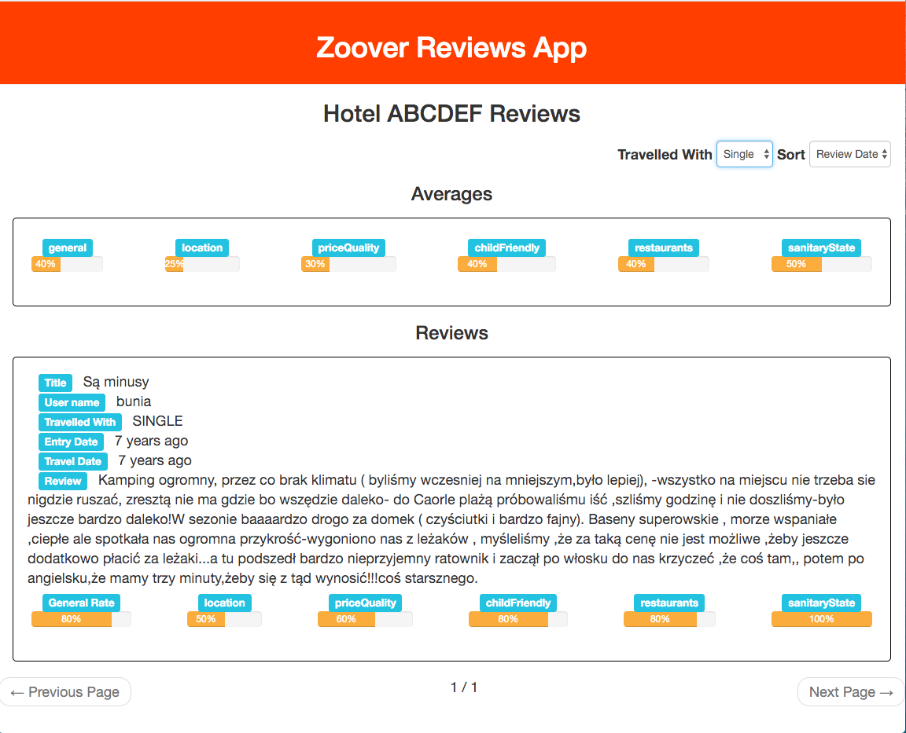

# Hotel Reviews App

This is a web app for showing hotel reviews build using ReactJs, ReduxJs and NodeJs.



## How to run it locally

- Clone the repository to your machine `git clone https://github.com/AnasFullStack/Hotel-Reviews-App.git`
- Change the directory to the project folder:

- Start the server first

```ShellSession
$ cd server
$ npm install
$ npm start
```

- Start a new shell and start the client

```ShellSession
$ cd app
$ npm install
$ npm start
```

## To run the tests

```ShellSession
$ cd server
$ npm test
```
